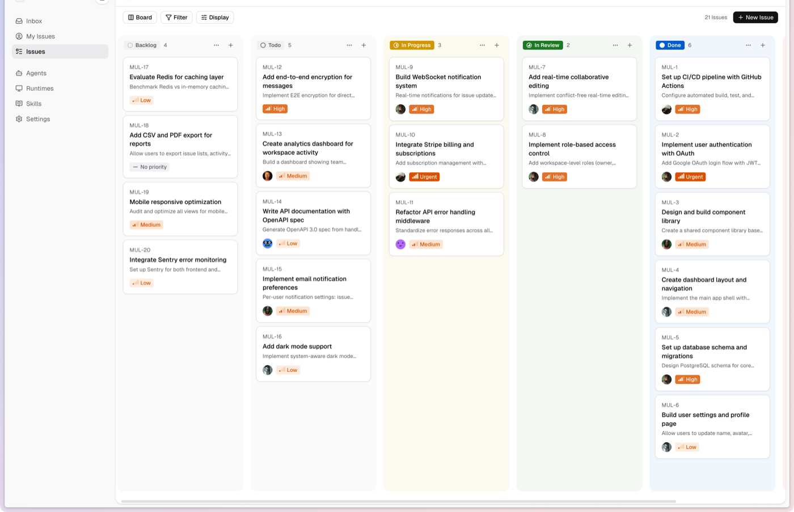
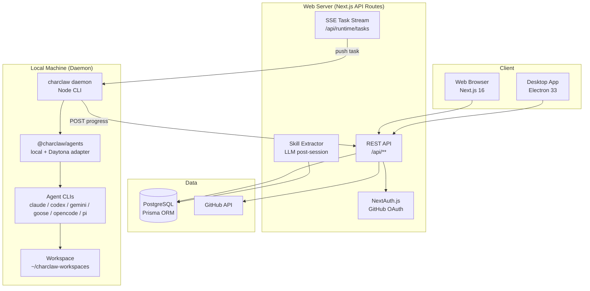
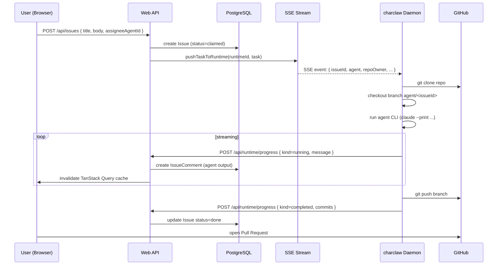
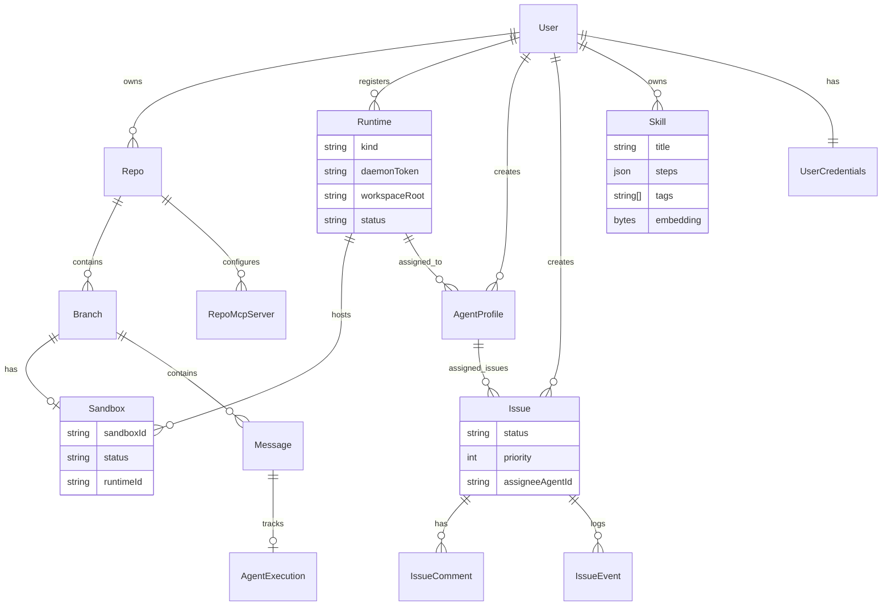
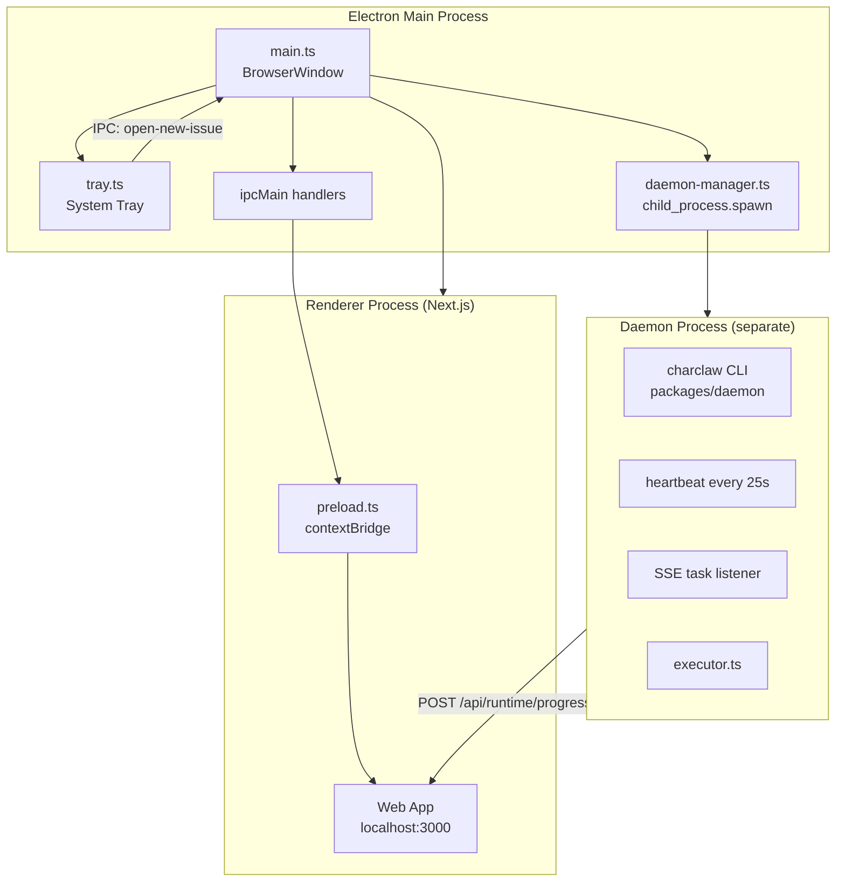
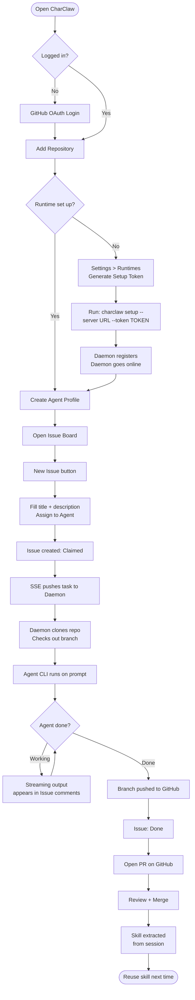

<div align="center">
  <a href="https://anitchaudhry.github.io/CharClaw-App/">
    
  </a>

  <h1>
    <a href="https://anitchaudhry.github.io/CharClaw-App/">🐍 CharClaw</a>
  </h1>
  <p><strong>Your AI dev team, running locally.</strong></p>
  <p>Open-source platform to run AI coding agents (Claude Code, Codex, Gemini, Goose, and more) on your own machine — no cloud sandboxes needed.</p>

  <p>
    <a href="https://anitchaudhry.github.io/CharClaw-App/"><strong>Live site ↗</strong></a> •
    <a href="#-one-command-install">Install</a> •
    <a href="#-see-it-in-action">Screenshots</a> •
    <a href="#features">Features</a> •
    <a href="#architecture">Architecture</a> •
    <a href="#configuration">Configuration</a> •
    <a href="#desktop-app">Desktop App</a> •
    <a href="#faq">FAQ</a>
  </p>

  <a href="https://www.npmjs.com/package/@charclaw/agents"></a>
  
  
  
  
  
  
</div>

---

## What is CharClaw?

CharClaw is a **self-hosted AI engineering platform** where you assign GitHub issues to AI agents and they code, commit, and push solutions — running entirely on your local machine or a machine you control.

It ships as:
- **Web App** — Next.js dashboard accessible from any browser (cloud or self-hosted)
- **Desktop App** — Electron wrapper with a built-in daemon; double-click, assign issues, done

A self-hosted issue board + agent runtime that treats AI coding agents as teammates — they pick up issues, write code, open PRs, and compound reusable skills over time.

The agent execution layer is open source on its own — install [`@charclaw/agents`](https://www.npmjs.com/package/@charclaw/agents) from npm (AGPL-3.0):

```bash
npm install @charclaw/agents @daytonaio/sdk
```

[Read the docs](https://anitchaudhry.github.io/CharClaw-App/docs/agents-sdk.html) or the [launch post](https://anitchaudhry.github.io/CharClaw-App/blog/launching-charclaw-agents-sdk.html).

---

## 📸 See it in action

<div align="center">
  
  <br />
  <sub><em>The CharClaw Issue Board — drag issues across columns, assign them to AI agents, and watch streaming progress land in real time.</em></sub>
</div>

At a glance in the screenshot above:

- **Five-column Kanban workflow** — Backlog → Todo → In Progress → In Review → Done
- **Agent assignees** — each card shows which AI agent owns the issue and its priority
- **Live issue counts per column** so you always know the state of your backlog
- **Sidebar navigation** to switch between Inbox, My Issues, Agents, Runtimes, Skills, and Settings
- **One-click "New Issue"** top-right to hand a task to your AI team

---

## Features

### Core
| Feature | Description |
|---|---|
| **Local Runtime** | Agents run on your own machine — no cloud sandbox fees |
| **Multi-Agent** | Claude Code, OpenAI Codex, Google Gemini, Goose, OpenCode, and custom CLIs |
| **Issue Board** | Kanban-style board: Backlog → Claimed → In Progress → Blocked → Done |
| **Agent Profiles** | Create agent teammates with a name, slug, avatar, bio, and assigned runtime |
| **Skills Library** | Completed sessions are automatically distilled into reusable playbooks |
| **Streaming Progress** | Live output streams from the agent back to the web UI via SSE |
| **PR Automation** | Agent commits on a branch and pushes; one click to open a PR |

### Teams & Collaboration
| Feature | Description |
|---|---|
| **Multi-Workspace** | Every resource (repos, agents, issues, runtimes) scoped to a workspace. Invite members with `owner`/`admin`/`member` roles. Workspace switcher in the sidebar; URLs live under `/w/:slug/…`. |
| **Projects** | Group issues into projects with color, icon, and slug. Filter the board by project, assign/unassign from an issue, archive without deletion. |
| **Mentions** | `@user` and `@agent` in issue comments — mentions resolve to `WorkspaceMember` users or `AgentProfile` slugs within the workspace and fan out to the inbox. |
| **Inbox** | Per-user notification feed for mentions, assignments, and autopilot results. Header bell with unread badge; "mark all as read" and one-click navigation to the source. |
| **Chat with Agents** | Direct 1:1 conversations with an agent profile, separate from issue chat. Composer with `Cmd/Ctrl+Enter` send, offline-agent stub reply, live SSE updates. |
| **Autopilots** | Declarative recurring agent jobs. Configure a cron schedule, title/body templates, target repo, and agent — fires automatically and creates issues on trigger. Manual "run now" supported. |
| **Pins** | Per-user saved filters and shortcuts in the sidebar. Pin an issue-filter query, a project, a conversation, a repo, or an external URL. Drag to reorder. |

### Desktop
| Feature | Description |
|---|---|
| **System Tray** | "New Issue" shortcut from the tray; runs in the background |
| **Daemon Manager** | Spawns and supervises the local runtime daemon automatically |
| **Auto-Updater** | electron-updater keeps the app current |
| **Cross-platform** | macOS (universal), Windows (NSIS), Linux (AppImage) |
| **Configurable backend** | `CHARCLAW_SERVER_URL` env var picks the backend at build or runtime; dev defaults to `localhost:3000`, prod to the hosted backend |

### Platform
| Feature | Description |
|---|---|
| **GitHub OAuth** | Sign in with GitHub, full repo browser; scopes `repo` + `read:user` |
| **MCP Servers** | Per-repo Model Context Protocol server config |
| **Activity Logs** | Full audit trail of every agent action |
| **Dev Mode** | `GITHUB_PAT` env var bypasses OAuth for local development; auto-logs in as a seeded dev user |

---

## Architecture

### Workspace model

Every resource in CharClaw lives inside a **Workspace**. A user auto-receives a personal workspace on first login (role `owner`) and can be invited to additional workspaces as `owner`, `admin`, or `member`.

- **Workspace-scoped tables**: `Repo`, `Runtime`, `AgentProfile`, `Project`, `Issue`, `Skill`, `InboxItem`, `Conversation`, `Autopilot`, `Pin`. Every API query filters by `workspaceId` via `requireWorkspaceAccess` — non-members receive 403.
- **URL structure**: legacy global routes (`/board`, `/skills`, `/workspace`) still work and default to the active workspace. New collaboration features live under `/w/:slug/…`:

```
/w/:slug/projects          # Project list
/w/:slug/projects/:p       # Project detail + filtered issues
/w/:slug/inbox             # Mentions + notifications
/w/:slug/chat              # Direct chat list
/w/:slug/chat/:id          # Conversation detail
/w/:slug/autopilots        # Recurring agent jobs
/w/:slug/autopilots/new
/w/:slug/autopilots/:id
/w/:slug/pins              # Saved filters and shortcuts
```

The sidebar has a workspace switcher (small initial-badge dropdown) and surfaces all workspace-scoped features in the user menu once a workspace is active.

### System Overview



### Request Flow — Issue Assignment to PR



### Data Model



### Desktop App Process Model



---

## User Flow



---

## 🚀 One-command install

Works on **macOS**, **Linux**, and **Windows** (Git Bash or PowerShell). Prerequisites: Node.js 18+, Git, and Postgres (or a Neon/Supabase URL).

<details open>
<summary><strong>macOS / Linux</strong></summary>

```bash
git clone https://github.com/AnitChaudhry/CharClaw-App.git
cd CharClaw-App
bash scripts/setup.sh
npm run dev
```

</details>

<details>
<summary><strong>Windows (Git Bash)</strong></summary>

```bash
git clone https://github.com/AnitChaudhry/CharClaw-App.git
cd CharClaw-App
bash scripts/setup.sh
npm run dev
```

</details>

<details>
<summary><strong>Windows (PowerShell)</strong></summary>

```powershell
git clone https://github.com/AnitChaudhry/CharClaw-App.git
cd CharClaw-App
powershell -ExecutionPolicy Bypass -File scripts\setup.ps1
npm run dev
```

</details>

The setup script is idempotent — it:

1. Checks Node.js + Git, installs npm dependencies
2. Creates `packages/web/.env` from the template and generates secrets (`NEXTAUTH_SECRET`, `ENCRYPTION_KEY`, `AUTOPILOT_CRON_SECRET`) using Node's crypto module — no OpenSSL needed on Windows
3. Applies the Prisma schema to your database
4. Prints the `npm run dev` command + a link to the in-app onboarding page

Then open <http://localhost:3000/setup> to finish configuration: pick runtime (local vs Daytona), install agent CLIs, add AI provider keys. Or open <http://localhost:3000> to jump straight into the app.

> **AI-agent tip:** paste this entire README at an AI assistant (Claude Code, Cursor, etc.) in your freshly-cloned repo and ask it to "set up CharClaw on my machine." It has everything it needs here.

---

## Manual setup (if you skip the script)

<details>
<summary>Expand for the step-by-step</summary>

### Prerequisites

- Node.js >= 18
- PostgreSQL (local install, [Neon](https://neon.tech) free tier, or [Supabase](https://supabase.com))
- (Optional) GitHub OAuth App for real sign-in — [create one](https://github.com/settings/applications/new) with callback `http://localhost:3000/api/auth/callback/github`
- (Optional) At least one agent CLI on PATH (`claude`, `codex`, `gemini`, `goose`, `opencode`, `pi`)

### 1. Clone & install

```bash
git clone https://github.com/AnitChaudhry/CharClaw-App.git
cd CharClaw-App
npm install
```

### 2. Configure env

```bash
cp .env.example packages/web/.env
# fill in DATABASE_URL and either GITHUB_PAT (dev-mode bypass) or GITHUB_CLIENT_ID/SECRET
```

Generate secrets (Node works on all platforms, no OpenSSL needed):

```bash
node -e "console.log(require('crypto').randomBytes(32).toString('base64'))"  # NEXTAUTH_SECRET
node -e "console.log(require('crypto').randomBytes(32).toString('hex'))"     # ENCRYPTION_KEY
```

See [Configuration](#configuration) for every variable.

### 3. Database

```bash
cd packages/web
npx prisma generate --schema prisma/schema.prisma
npx prisma db push --schema prisma/schema.prisma --accept-data-loss
cd ../..
```

### 4. Start everything

```bash
npm run dev
```

Boots the web server on port 3000 **and** the local runtime daemon together (color-coded output: cyan `[web]`, magenta `[daemon]`). Open <http://localhost:3000/setup>.

### 5. In-app onboarding

The `/setup` page surveys your environment and shows exactly what's missing: detected agent CLIs, runtime status, AI provider keys. Install missing pieces, click **Recheck**, then hit **Open CharClaw** when everything's green.

</details>

---

## Configuration

Copy `.env.example` to `.env` and fill in:

| Variable | Required | How to get it |
|---|---|---|
| `DATABASE_URL` | Yes | PostgreSQL connection string (pooled). Free tier: [neon.tech](https://neon.tech) |
| `DATABASE_URL_UNPOOLED` | Yes | PostgreSQL direct connection (for migrations) |
| `NEXTAUTH_SECRET` | Yes | `openssl rand -base64 32` |
| `NEXTAUTH_URL` | Yes | Your app URL, e.g. `http://localhost:3000` |
| `GITHUB_CLIENT_ID` | Yes | From your [GitHub OAuth App](https://github.com/settings/developers) |
| `GITHUB_CLIENT_SECRET` | Yes | From your GitHub OAuth App |
| `ENCRYPTION_KEY` | Yes | `openssl rand -hex 32` — encrypts user API keys at rest |
| `DAYTONA_API_KEY` | No | Legacy cloud-sandbox provider key. Not required for normal use. |
| `SMITHERY_API_KEY` | No | MCP server discovery ([smithery.ai](https://smithery.ai)) |
| `OPENROUTER_API_KEY` | No | Free fallback LLM for branch naming |

### GitHub OAuth App

1. [Create an OAuth App](https://github.com/settings/applications/new)
2. **Homepage URL**: `http://localhost:3000`
3. **Authorization callback URL**: `http://localhost:3000/api/auth/callback/github`
4. Copy Client ID and generate a Client Secret into `.env`

### Per-User AI Keys (set in Settings UI)

Each user configures their own AI provider keys in **Settings → Credentials**. CharClaw encrypts them at rest using `ENCRYPTION_KEY`. They are never sent to any third-party server — they're passed directly to the agent CLI:

| Agent | Key needed |
|---|---|
| Claude Code (`claude`) | Anthropic API key |
| Codex (`codex`) | OpenAI API key |
| Gemini (`gemini`) | Google Gemini API key |
| OpenCode (`opencode`) | OpenCode API key |

---

## Desktop App

### Development

```bash
# Terminal 1 — web server
npm run dev

# Terminal 2 — Electron
npm run dev:desktop
```

### Production Build

```bash
# All platforms (from their native OS)
npm run build:desktop

# macOS universal DMG
npm run build:mac -w @charclaw/desktop

# Windows NSIS installer
npm run build:win -w @charclaw/desktop

# Linux AppImage
npm run build:linux -w @charclaw/desktop
```

Distributables appear in `packages/desktop/release/`.

---

## Monorepo Structure

```
charclaw/
├── packages/
│   ├── web/              # Next.js 16 web app + API routes
│   │   ├── app/          # App Router pages + API
│   │   │   ├── api/      # REST endpoints
│   │   │   │   ├── workspaces/    # Workspace list/create/detail
│   │   │   │   ├── workspace/     # Workspace member management
│   │   │   │   ├── projects/      # Project CRUD + per-project issues
│   │   │   │   ├── inbox/         # Inbox items (list, counts, read-all)
│   │   │   │   ├── mentions/      # Mention resolver preview
│   │   │   │   ├── conversations/ # Chat-with-agent conversations + messages + SSE stream
│   │   │   │   ├── autopilots/    # Recurring agent jobs + runs + cron tick
│   │   │   │   ├── pins/          # Per-user saved filters / shortcuts
│   │   │   │   ├── issues/        # Issue CRUD + comments (with mention fanout)
│   │   │   │   ├── runtime/       # Daemon registration, heartbeat, SSE, progress
│   │   │   │   ├── agent-profiles/ # Agent teammate management
│   │   │   │   ├── skills/        # Skill library
│   │   │   │   └── agent/execute/ # Sandbox agent execution
│   │   │   ├── board/             # Issue Board (root-level)
│   │   │   ├── workspace/         # Workspace settings page
│   │   │   ├── w/[workspaceSlug]/ # Workspace-scoped routes
│   │   │   │   ├── projects/      # Project list + detail
│   │   │   │   ├── inbox/         # Inbox page
│   │   │   │   ├── chat/          # Conversation list + detail
│   │   │   │   ├── autopilots/    # Autopilot list / new / detail
│   │   │   │   └── pins/          # Pin management
│   │   │   └── [owner]/[repo]/    # Repo + Branch chat views
│   │   ├── components/
│   │   │   ├── workspace/  # WorkspaceProvider context + useWorkspace hook
│   │   │   ├── projects/   # ProjectCard, NewProjectDialog, ProjectsSidebarNav, ProjectPicker
│   │   │   ├── inbox/      # InboxBell, InboxList, MentionText
│   │   │   ├── chat-with-agent/ # ConversationList/View, Composer, MessageBubble
│   │   │   ├── autopilots/ # AutopilotCard/Form, CronInput, RunsList
│   │   │   ├── pins/       # PinItem, PinsSidebarNav, AddPinDialog
│   │   │   ├── issues/     # IssueBoard, IssueCard, CreateIssueDialog
│   │   │   ├── sidebar/    # RepoSidebar with workspace switcher + feature nav
│   │   │   └── ui/         # Radix UI primitive wrappers
│   │   ├── hooks/          # useIssues, useProjects, useInbox, useConversations, useAutopilots, usePins, ...
│   │   ├── lib/
│   │   │   ├── auth/       # workspace helpers (requireWorkspaceAccess, getActiveWorkspace)
│   │   │   ├── mentions/   # Mention parser + inbox fanout
│   │   │   ├── autopilots/ # Cron parser + fire logic
│   │   │   ├── chat/       # Conversation event emitter (SSE)
│   │   │   ├── pins/       # Pin href resolver
│   │   │   ├── sandbox/    # LocalMachineSandbox + runtime resolver
│   │   │   ├── skills/     # Skill extraction post-session
│   │   │   ├── runtime/    # Daemon auth helpers
│   │   │   └── stores/     # Zustand state
│   │   └── prisma/         # Schema + migrations (Workspace, Project, InboxItem,
│   │                       #   Conversation, ConversationMessage, Autopilot,
│   │                       #   AutopilotRun, Pin + existing models)
│   ├── daemon/           # @charclaw/daemon — local runtime CLI
│   │   └── src/
│   │       ├── index.ts         # Commander CLI (setup / start / status / agents)
│   │       ├── register.ts      # Machine registration with server
│   │       ├── heartbeat.ts     # 25s keep-alive pings
│   │       ├── executor.ts      # Task execution: clone → run → push
│   │       ├── task-stream.ts   # SSE subscriber (reconnecting)
│   │       └── cli-detector.ts  # Detect installed agent CLIs
│   ├── desktop/          # @charclaw/desktop — Electron wrapper
│   │   └── src/
│   │       ├── main.ts          # BrowserWindow + app lifecycle
│   │       ├── preload.ts       # contextBridge (renderer ↔ main)
│   │       ├── tray.ts          # System tray menu
│   │       └── daemon-manager.ts # Daemon child process supervisor
│   ├── agents/           # @charclaw/agents — public SDK (AGPL-3.0)
│   │   └── src/
│   │       ├── session.ts         # createSession / getSession entry points
│   │       ├── background/        # BackgroundSession, polling, persistence
│   │       ├── sandbox/           # Daytona + local sandbox adapters
│   │       ├── agents/            # Per-agent CLI commands + JSON parsers
│   │       │                      #   (claude, codex, gemini, goose,
│   │       │                      #    opencode, pi, mock)
│   │       └── core/              # Agent definition + tool name registry
│   ├── simple-chat/      # @charclaw/simple-chat — minimal chat reference app
│   ├── terminal/         # @charclaw/terminal — xterm-based terminal panel
│   ├── landing/          # @charclaw/landing — Vite + React marketing landing
│   └── common/           # @charclaw/common — shared types, agent config,
│                         #   git utilities, slash commands, SSE helpers
└── .env.example          # All required env vars documented
```

---

## Tech Stack

| Layer | Technology |
|---|---|
| **Frontend** | Next.js 16 (App Router, webpack mode), React 19, Tailwind CSS v4, Radix UI |
| **State** | Zustand (client UI state), TanStack Query v5 (server state) |
| **Backend** | Next.js API Routes, NextAuth.js v4 |
| **Database** | PostgreSQL, Prisma ORM v6 |
| **Desktop** | Electron 33, electron-builder, electron-updater |
| **Agent SDK** | [`@charclaw/agents`](./packages/agents) v0.2.0 — Claude / Codex / Gemini / Goose / OpenCode / Pi (AGPL-3.0) |
| **Sandbox runtimes** | Daytona cloud sandboxes + local-machine spawn (`@charclaw/agents/sandbox`) |
| **Real-time** | Server-Sent Events (SSE) — daemon task dispatch + progress |
| **Auth** | GitHub OAuth via NextAuth.js |

---

## FAQ

**Why "CharClaw"?**

> Named after the precision grip of a hawk — it grabs tasks, holds them, and delivers. The name signals focused, powerful execution: AI agents claw through your backlog so you don't have to.

**Why local execution instead of cloud sandboxes?**

> Cloud sandboxes cost money per minute, limit installable tools, and add latency. Your local machine has your dev environment, credentials, SSH keys, and more compute than any micro-VM. CharClaw runs agents where the work lives.

**How is CharClaw different from just running `claude --print "fix the bug"`?**

> CharClaw adds the workflow layer: issue tracking, branch management, streaming progress, PR automation, team sharing, and a skills library that learns from every session. It's the difference between a command and a teammate.

**Can I use CharClaw with my existing GitHub workflow?**

> Yes. CharClaw creates branches off your configured base branch, commits work, and pushes. You review and merge PRs exactly as you normally would. CharClaw never touches `main` directly.

**Is my code sent to Anthropic or any third party through CharClaw?**

> No. The agent CLI (e.g. `claude`) runs on your machine and communicates directly with the AI API using **your own API key**. CharClaw's server only stores agent stdout snippets (progress messages) and issue metadata in **your own database**.

**What AI agents are supported?**

> Out of the box: Claude Code (`claude`), OpenAI Codex (`codex`), Google Gemini (`gemini`), Block Goose (`goose`), OpenCode (`opencode`), and Pi (`pi`). The chat picker auto-detects which CLIs are installed on your runtime via the daemon's `--version` probe and grays out unavailable agents. Adding a new agent means writing a small `AgentDefinition` in `packages/agents/src/agents/<name>/` — see the existing implementations as reference.

**Why are some agents grayed out in the picker?**

> The daemon detects which agent CLIs are reachable on your machine and reports them to the web app every ~25 seconds. The chat picker uses that list to gray out agents whose CLI isn't installed (tooltip: *"Install &lt;Agent&gt; CLI on your runtime"*). Click the grayed entry to open Settings; install the CLI locally (e.g. `npm install -g @anthropic-ai/claude-code`), restart the daemon, and the picker un-grays it.

**How does the Skills Library work?**

> After every completed session, CharClaw calls your configured LLM to extract a structured playbook: title, description, ordered steps, and tags. Skills appear in the `Cmd/Ctrl+K` search palette so you can apply proven patterns to new issues automatically.

**Can I self-host CharClaw?**

> Yes — that's the primary design goal. Deploy the Next.js app to any Node.js host (Vercel, Railway, Render, or a VPS). Point `DATABASE_URL` at your PostgreSQL instance, configure GitHub OAuth, and you're live.

**What's the difference between the Web App and Desktop App?**

> The **Web App** is a browser dashboard — great for remote access and team sharing. The **Desktop App** adds: tray integration, automatic daemon lifecycle management, and a native "New Issue" shortcut. Both use the same codebase; the Desktop App simply wraps the web server in Electron and runs the daemon automatically.

**Do I need to leave the app open for agents to keep working?**

> No. The daemon is a persistent background process. Once an issue is assigned, close the browser — the daemon keeps running, posting progress to the database. Re-open anytime to check results.

---

## License

CharClaw uses **dual licensing** to balance permissive app forking with copyleft on the agent execution core:

| Surface | License | Notes |
|---|---|---|
| App (web, daemon, desktop, landing, simple-chat, common, terminal) | **Apache 2.0** | Fork freely, change the brand, ship it commercially. |
| Agent SDK ([`@charclaw/agents`](./packages/agents)) | **AGPL-3.0-or-later** | Fork freely; modifications run as a network service must be open-sourced too. Need a commercial license? Email `anitc98@gmail.com`. |

The full text of each license lives in [`LICENSE`](./LICENSE).

---

## Contributing

Pull requests welcome. For major changes, open an issue first.

```bash
# Type check
npx tsc --noEmit -p packages/web/tsconfig.json

# Lint
npm run lint
```

---

## License

Apache 2.0 — see [LICENSE](LICENSE).

---

<div align="center">
  <sub>Built with Claude Code · CharClaw — AI agents that get things done</sub>
</div>
